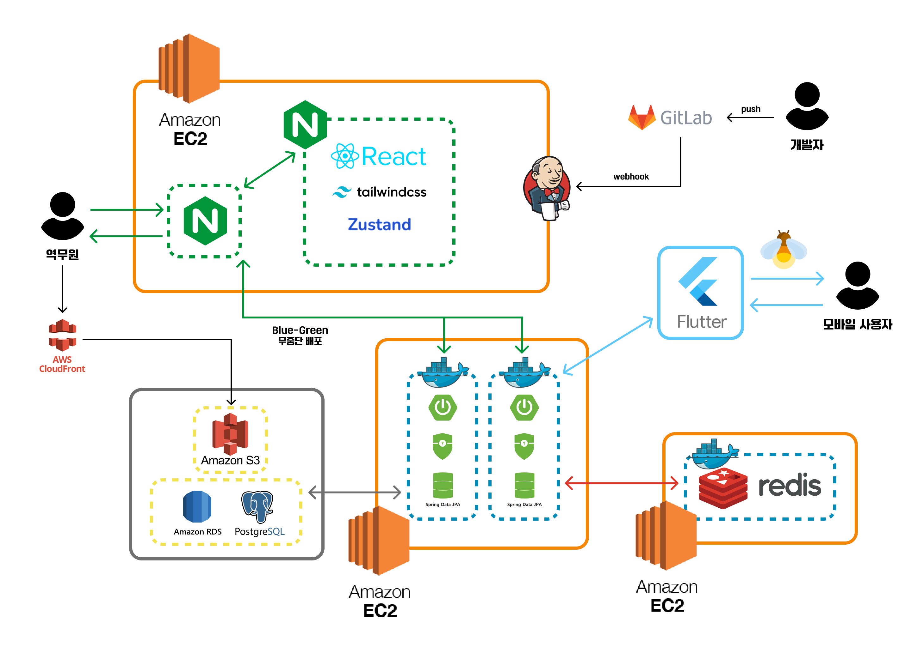
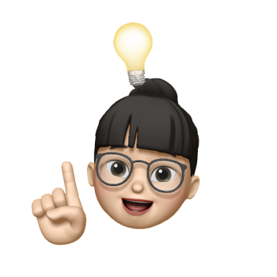

E102# :house_with_garden: 반딧불이 - 시각장애인 길찾기 서비스

## :link: 반딧불이 링크(웹 화면): [반딧불이 :banditbul: 으로 이동](https://banditbul.co.kr)
## :cinema: 소개 영상 보기: [UCC](https://youtu.be/SHvd28duZ0A)
## 소개 PPT: [내돈내산 PPT](https://lab.ssafy.com/s10-bigdata-recom-sub2/S10P22E204/-/blob/master/exec/10%EA%B8%B0_%ED%8A%B9%ED%99%94PJT_%EB%B0%9C%ED%91%9C%EC%9E%90%EB%A3%8C_E204.pdf?ref_type=heads)

## :date: 프로젝트 진행 기간
**2024.04.08(월) ~ 2024.05.17(금)**: 6weeks

SSAFY 10기 2학기 자율 프로젝트 - 반딧불이 :house:

## :cherry_blossom: 내돈내산 기획 배경
:bulb: 지방 거주자가 서울에 자취방을 구할 때 정보 부족으로 인한 어려움을 해결
:heavy_check_mark: 집을 구할 때 인프라를 기준으로 동네를 정할 수 있도록 **인프라 기반 선호도** 조사
:heavy_check_mark: 인프라 기반으로 동을 군집화하여 적절한 동네를 사용자에게 추천해준다!

## :hammer: 개발 환경 및 기술 스택
### FE

 

### BE
 

 

### INFRA

 

### 버전/이슈 관리
 

### 협업
 

## :bar_chart: 아키텍처 구조

## :file_folder: 프로젝트 파일 구조

<b>FE</b>

<pre>
<code>
여기구조도 넣어야함
</code>
</pre>

<b>BE</b>

<pre>
<code>
여기 구조도 넣어야함
 </code>
 </pre>

<b>ML</b>

<pre>
<code>
</code>
</pre>

## :sparkler: 반딧불이 주요 기능
### 0. 입장 페이지

### 1. 동네 추천 페이지

### 2. 매물 페이지

### 3. 동네 비교 페이지

### 4. 동네 정보 페이지

### 5. 마이페이지

## :memo: 프로젝트 산출물
- [프로토타입](https://www.figma.com/file/bBPcUcmCZg5fgGhJ1OfW6r/%EB%82%B4%EB%8F%88%EB%82%B4%EC%82%B0?type=design&node-id=0-1&mode=design&t=Usom68rZGy5AMPmq-0)
- [요구사항 명세서](https://www.notion.so/f9f680e00c9a4bb384ed23b73671370d)
- [API 명세서](https://www.notion.so/API-5ee34edf880f426bb3e901878e650d00)
- [ERD](https://www.notion.so/DB-ERD-a3b7e487c42c4cf8a5835055831efa82)
- [포팅 매뉴얼](https://lab.ssafy.com/s10-bigdata-recom-sub2/S10P22E204/-/blob/master/exec/%ED%8F%AC%ED%8C%85%EB%A7%A4%EB%89%B4%EC%96%BC.md?ref_type=heads)

## :family: 팀원 소개
<table>
  <tbody>
    <tr>
      <td align="center"><a href="https://github.com/ttaho"> <b>BE 팀장 : 윤태호</b></a> </td>
      <td align="center"><a href="https://github.com/MunsooKang"> <b>FE 팀원 : 강문수</b></a> </td>
      <td align="center"><a href="https://github.com/arim-kim"> <b>BE 팀원 : 김아림</b></a> </td>
      <td align="center"><a href="https://github.com/makie082"> <b>BE 팀원 : 우미경</b></a> </td>
      <td align="center"><a href="https://github.com/dogfish000"> <b>FE 팀원 : 윤태우</b></a> </td>
      <td align="center"><a href="https://github.com/RaelJung"> <b>FE 팀원 : 정라엘</b></a> </td>
    </tr>
  </tbody>
</table>