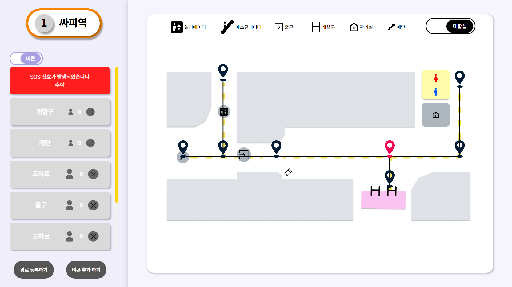

E102 반딧불이 - 시각장애인 길찾기 서비스

## :link: 반딧불이 링크(웹 화면): [반딧불이로 이동](https://banditbul.co.kr)
## :cinema: 소개 영상 보기: [UCC](https://www.youtube.com/watch?v=SGRwzu0fXKk)
## 소개 PPT: [반딧불이 PPT](https://www.miricanvas.com/v/137htix)

## :date: 프로젝트 진행 기간
**2024.04.08(월) ~ 2024.05.17(금)**: 6 weeks

SSAFY 10기 2학기 자율 프로젝트 - 반딧불이

## :cherry_blossom: 반딧불이 기획 배경
:bulb: 시각장애인의 지하철 역사 이용시 불편함을 해결 :heavy_check_mark:

시각장애인들이 어려워하는 개찰구, 화장실까지의 이동을 도와줌 :heavy_check_mark:

도움이 필요할땐 SOS 기능을 사용 :heavy_check_mark:

## :hammer: 개발 환경 및 기술 스택
### FE

 

 

### BE
 

 

### INFRA

 

### 버전/이슈 관리
 

### 협업
 

## :bar_chart: 아키텍처 구조

## :file_folder: 프로젝트 파일 구조

<b>FE</b>

<pre>
<code>
여기구조도 넣어야함
</code>
</pre>

<b>BE</b>

<pre>
<code>
여기 구조도 넣어야함
 </code>
 </pre>

<b>ML</b>

<pre>
<code>
</code>
</pre>

## :sparkler: 반딧불이 주요 기능
### 0. 메인 화면
- 메인페이지에서 현재역에서 목적지 역, 화장실까지 가는 길찾기 기능과 SOS 기능을 사용할 수 있습니다.
 

### 1. 길찾기 기능
- 현재 위치에서 목표로하는 지하철역이나 화장실까지 길찾기가 가능합니다.

### 2. SOS 기능
- 현재 위치에서 도움 요청하기 버튼으로 역무원에게 SOS를 요청할 수 있습니다.
 

### 3. 모니터링 페이지
- 앱 사용자의 위치를 추적해서 어디에 몇명이 있는지 확인가능 합니다.
- SOS 요청이 온 비콘 위치를 파악이 가능합니다.
 

## :memo: 프로젝트 산출물
- [프로토타입](https://www.figma.com/design/1NuhYsXKYgQ7yBdlf5K6bw/%EB%B0%98%EB%94%A7%EB%B6%88%EC%9D%B4?node-id=0-1&t=0te8ipivObtRz7Pq-0)
- [API 명세서](https://www.notion.so/ca30758094e2428d8c77a3b9a2d7967c?v=488b4874a45f42b7bc9de9bb810dc361)
- [ERD](https://www.erdcloud.com/d/M6pxrgNRqzHRv6Sqa)
- [포팅 매뉴얼](https://lab.ssafy.com/s10-final/S10P31E102/-/blob/master/exec/%ED%8F%AC%ED%8C%85%EB%A7%A4%EB%89%B4%EC%96%BC.md?ref_type=heads)

## :family: 팀원 소개
<table>
  <tbody>
    <tr>
      <td align="center"><a href="https://github.com/ttaho"> <b>BE 팀장 : 윤태호</b></a> </td>
      <td align="center"><a href="https://github.com/MunsooKang"> <b>FE 팀원 : 강문수</b></a> </td>
      <td align="center"><a href="https://github.com/arim-kim"> <b>BE 팀원 : 김아림</b></a> </td>
      <td align="center"><a href="https://github.com/makie082"> <b>BE 팀원 : 우미경</b></a> </td>
      <td align="center"><a href="https://github.com/dogfish000"> <b>FE 팀원 : 윤태우</b></a> </td>
      <td align="center"><a href="https://github.com/RaelJung"> <b>FE 팀원 : 정라엘</b></a> </td>
    </tr>
  </tbody>
</table>