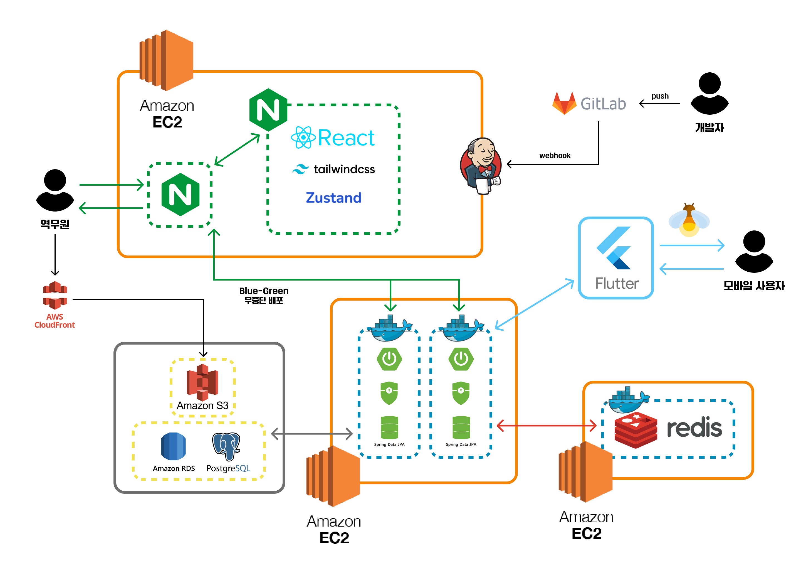
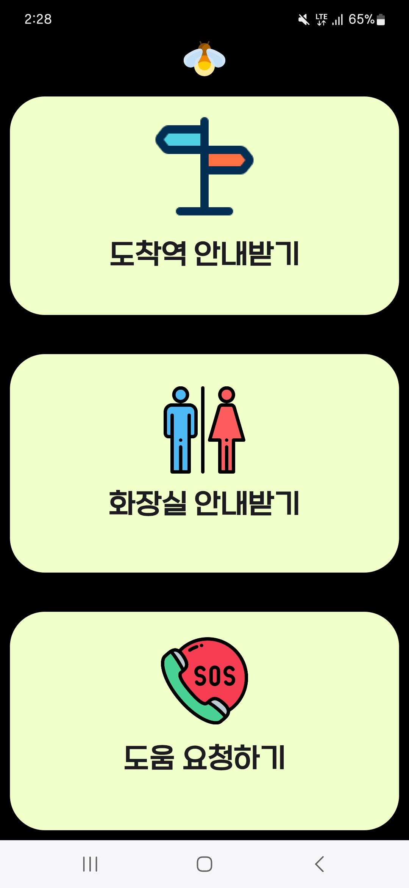
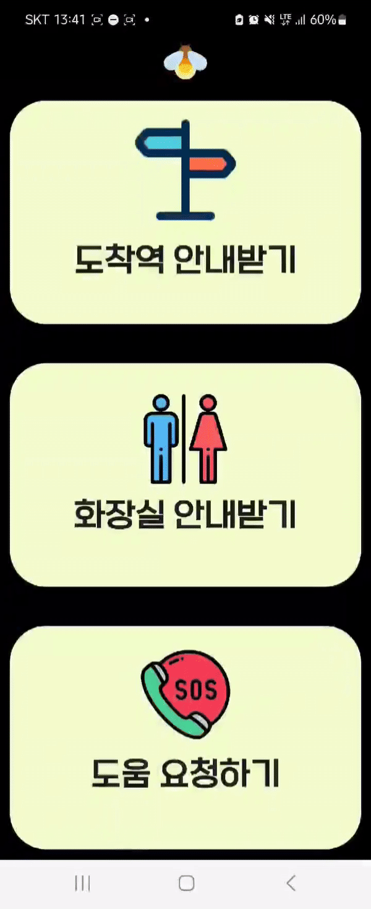
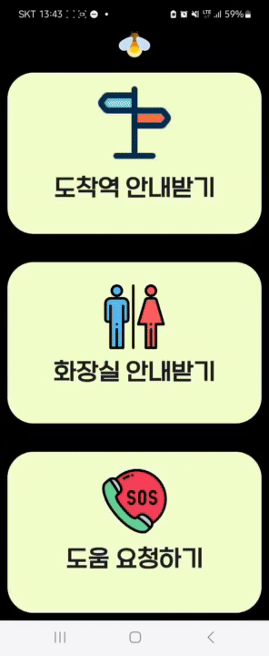
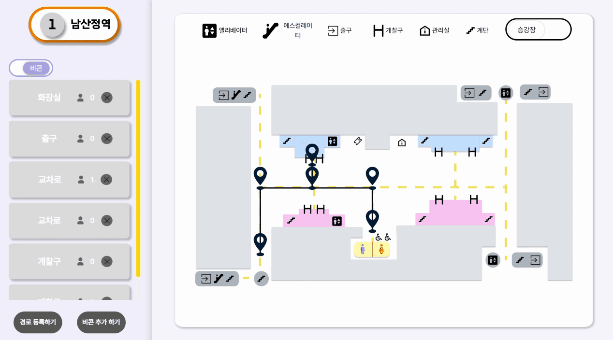

# :fire 반딧불이 - 시각장애인 길찾기 서비스

## :link: 반딧불이 링크(웹 화면): [반딧불이로 이동](https://banditbul.co.kr)
## :cinema: 소개 영상 보기: [UCC](https://www.youtube.com/watch?v=SGRwzu0fXKk)
## 📓 소개 PPT: [반딧불이 PPT](https://www.miricanvas.com/v/137htix)

## :date: 프로젝트 진행 기간
**2024.04.08(월) ~ 2024.05.17(금)**: 6 weeks

SSAFY 10기 2학기 자율 프로젝트 - 반딧불이

## :cherry_blossom: 반딧불이 기획 배경
:bulb: 시각장애인의 지하철 역사 이용시 불편함을 해결 :heavy_check_mark:

시각장애인들이 어려워하는 개찰구, 화장실까지의 이동을 도와줌 :heavy_check_mark:

도움이 필요할땐 SOS 기능을 사용 :heavy_check_mark:

## :hammer: 개발 환경 및 기술 스택
### FE

 

 

### BE
 

 

### INFRA

 

### 버전/이슈 관리
 

### 협업
 

## :bar_chart: 아키텍처 구조

## :file_folder: 프로젝트 파일 구조

<b>FE</b>

  
<b>WEB</b>

  <pre>
  <code>
  web
├─ .eslintrc.cjs
├─ .gitignore
├─ index.html
├─ package-lock.json
├─ package.json
├─ postcss.config.js
├─ public
│  └─ vite.svg
├─ README.md
├─ src
│  ├─ App.tsx
│  ├─ assets
│  │  ├─ addBeaconInfo.png
│  │  ├─ blue.gif
│  │  ├─ blueBeacon.gif
│  │  ├─ blueBeacon2.gif
│  │  ├─ default.gif
│  │  ├─ defaultBeacon.gif
│  │  ├─ IconArrowPrev.svg
│  │  ├─ IconDelete.png
│  │  ├─ IconDelete.svg
│  │  ├─ IconDownArrow.svg
│  │  ├─ IconElevator.svg
│  │  ├─ IconElevatorWhite.svg
│  │  ├─ IconEscalator.svg
│  │  ├─ IconEscalatorWhite.svg
│  │  ├─ IconExit.svg
│  │  ├─ IconExitWhite.svg
│  │  ├─ IconGate.svg
│  │  ├─ IconGateWhite.svg
│  │  ├─ IconInfo.svg
│  │  ├─ IconInfoWhite.svg
│  │  ├─ IconStair.svg
│  │  ├─ IconStairWhite.svg
│  │  ├─ iconStationTitle.png
│  │  ├─ IconUser.svg
│  │  ├─ id.png
│  │  ├─ loginBg.png
│  │  ├─ mainBackground.png
│  │  ├─ pw.png
│  │  ├─ red.gif
│  │  ├─ redBeacon.gif
│  │  ├─ redBeacon2.gif
│  │  ├─ testBg.png
│  │  ├─ yellow.gif
│  │  └─ yellowBeacon.gif
│  ├─ components
│  │  ├─ addBeacon
│  │  │  ├─ beaconTypeComponent.module.css
│  │  │  └─ beaconTypeComponent.tsx
│  │  ├─ header.tsx
│  │  ├─ Login.tsx
│  │  ├─ map.module.css
│  │  ├─ Map.tsx
│  │  ├─ Privacy.tsx
│  │  └─ slideToggle
│  │     ├─ EdgeToggle.tsx
│  │     └─ toggle.tsx
│  ├─ index.css
│  ├─ main.tsx
│  ├─ store.tsx
│  ├─ util
│  │  ├─ axios.ts
│  │  ├─ type.tsx
│  │  └─ WebSocketUtils.ts
│  └─ vite-env.d.ts
├─ tailwind.config.js
├─ tsconfig.json
├─ tsconfig.node.json
└─ vite.config.ts
  </code>
  </pre>

  
<b>APP</b>

  <pre>
  <code>
  application
├─ .env
├─ .gitignore
├─ .metadata
├─ .vscode
│  ├─ launch.json
│  └─ settings.json
├─ analysis_options.yaml
├─ android
│  ├─ app
│  │  ├─ build.gradle
│  │  ├─ key.jks
│  │  └─ src
│  │     ├─ debug
│  │     │  └─ AndroidManifest.xml
│  │     ├─ main
│  │     │  ├─ AndroidManifest.xml
│  │     │  ├─ java
│  │     │  │  └─ io
│  │     │  │     └─ flutter
│  │     │  │        └─ plugins
│  │     │  │           └─ GeneratedPluginRegistrant.java
│  │     │  ├─ kotlin
│  │     │  │  └─ blind
│  │     │  │     └─ banditbul
│  │     │  │        └─ MainActivity.kt
│  │     │  └─ res
│  │     │     ├─ drawable
│  │     │     ├─ drawable-hdpi
│  │     │     ├─ drawable-mdpi
│  │     │     ├─ drawable-night-hdpi
│  │     │     ├─ drawable-night-mdpi
│  │     │     ├─ drawable-night-xhdpi
│  │     │     ├─ drawable-night-xxhdpi
│  │     │     ├─ drawable-night-xxxhdpi
│  │     │     ├─ drawable-v21
│  │     │     ├─ drawable-xhdpi
│  │     │     ├─ drawable-xxhdpi
│  │     │     ├─ drawable-xxxhdpi
│  │     │     ├─ mipmap-hdpi
│  │     │     ├─ mipmap-mdpi
│  │     │     ├─ mipmap-xhdpi
│  │     │     ├─ mipmap-xxhdpi
│  │     │     ├─ mipmap-xxxhdpi
│  │     │     ├─ values
│  │     │     ├─ values-night
│  │     │     ├─ values-night-v31
│  │     │     └─ values-v31
│  │     └─ profile
│  │        └─ AndroidManifest.xml
│  ├─ build.gradle
│  ├─ gradle
│  │  └─ wrapper
│  │     ├─ gradle-wrapper.jar
│  │     └─ gradle-wrapper.properties
│  ├─ gradle.properties
│  ├─ gradlew
│  ├─ gradlew.bat
│  ├─ key.properties
│  ├─ local.properties
│  └─ settings.gradle
├─ assets
│  ├─ fonts
│  │  ├─ Pretendard-Black.ttf
│  │  ├─ Pretendard-Bold.ttf
│  │  ├─ Pretendard-ExtraBold.ttf
│  │  ├─ Pretendard-ExtraLight.ttf
│  │  ├─ Pretendard-Light.ttf
│  │  ├─ Pretendard-Medium.ttf
│  │  ├─ Pretendard-Regular.ttf
│  │  ├─ Pretendard-SemiBold.ttf
│  │  ├─ Pretendard-Thin.ttf
│  │  ├─ SB 어그로 B.ttf
│  │  ├─ SB 어그로 L.ttf
│  │  └─ SB 어그로 M.ttf
│  ├─ icons
│  ├─ images
│  │  ├─ bandi_bug.png
│  │  ├─ bandi_bug_light.png
│  │  ├─ bandi_bug_light_red.png
│  │  ├─ navigation
│  │  ├─ search_road.png
│  │  ├─ search_text.png
│  │  ├─ search_toilet.png
│  │  ├─ search_voice.png
│  │  ├─ sos.png
│  │  ├─ splash
│  │  ├─ star_background.png
│  │  ├─ voice_button.png
│  │  └─ voice_recording.gif
│  ├─ sounds
│  │  ├─ start_beep.mp3
│  │  └─ stop_beep.mp3
│  └─ voice
│     └─ accept.mp3
├─ env
├─ flutter_native_splash.yaml
├─ ios
│  ├─ Flutter
│  │  ├─ AppFrameworkInfo.plist
│  │  ├─ Debug.xcconfig
│  │  ├─ flutter_export_environment.sh
│  │  ├─ Generated.xcconfig
│  │  └─ Release.xcconfig
│  ├─ Runner
│  │  ├─ AppDelegate.swift
│  │  ├─ Assets.xcassets
│  │  │  ├─ AppIcon.appiconset
│  │  │  │  ├─ Contents.json
│  │  │  ├─ LaunchBackground.imageset
│  │  │  │  ├─ background.png
│  │  │  │  └─ Contents.json
│  │  │  └─ LaunchImage.imageset
│  │  │     ├─ Contents.json
│  │  │     ├─ LaunchImage.png
│  │  │     ├─ LaunchImage@2x.png
│  │  │     ├─ LaunchImage@3x.png
│  │  │     └─ README.md
│  │  ├─ Base.lproj
│  │  │  ├─ LaunchScreen.storyboard
│  │  │  └─ Main.storyboard
│  │  ├─ GeneratedPluginRegistrant.h
│  │  ├─ GeneratedPluginRegistrant.m
│  │  ├─ Info.plist
│  │  └─ Runner-Bridging-Header.h
│  ├─ Runner.xcodeproj
│  │  ├─ project.pbxproj
│  │  ├─ project.xcworkspace
│  │  │  ├─ contents.xcworkspacedata
│  │  │  └─ xcshareddata
│  │  │     ├─ IDEWorkspaceChecks.plist
│  │  │     └─ WorkspaceSettings.xcsettings
│  │  └─ xcshareddata
│  │     └─ xcschemes
│  │        └─ Runner.xcscheme
│  ├─ Runner.xcworkspace
│  │  ├─ contents.xcworkspacedata
│  │  └─ xcshareddata
│  │     ├─ IDEWorkspaceChecks.plist
│  │     └─ WorkspaceSettings.xcsettings
│  └─ RunnerTests
│     └─ RunnerTests.swift
├─ lib
│  ├─ main.dart
│  ├─ scanBeacon
│  │  ├─ scan_screen.dart
│  │  ├─ snackbar.dart
│  │  └─ utils.dart
│  ├─ screens
│  │  ├─ arrive_page
│  │  │  └─ arrive_page.dart
│  │  ├─ main_page
│  │  │  ├─ main_page.dart
│  │  │  └─ widgets
│  │  │     └─ main_search_page.dart
│  │  ├─ navigation_page
│  │  │  └─ navigation_page.dart
│  │  ├─ search_page
│  │  │  ├─ backup
│  │  │  │  ├─ search_text_page_backup.dart
│  │  │  │  └─ search_voice_page_backup.dart
│  │  │  ├─ search_page.dart
│  │  │  ├─ search_text_page.dart
│  │  │  ├─ search_voice_page.dart
│  │  │  └─ widgets
│  │  │     ├─ chat_bubble.dart
│  │  │     └─ write_chat_bubble.dart
│  │  └─ sos_page
│  │     ├─ sos_page.dart
│  │     └─ widgets
│  │        ├─ sos_page_accept.dart
│  │        └─ sos_page_wait.dart
│  ├─ store
│  │  ├─ BeaconController.dart
│  │  ├─ MainController.dart
│  │  ├─ RouteController.dart
│  │  └─ SessionController.dart
│  ├─ test_navigate_page.dart
│  ├─ test_page.dart
│  └─ util
│     ├─ beacon_scanner.dart
│     ├─ dotted_border_text.dart
│     ├─ location.dart
│     ├─ neon_border_button.dart
│     ├─ stt_function.dart
│     ├─ title_bar.dart
│     ├─ tts_function.dart
│     ├─ voice_recognition_service.dart
│     └─ websocket.dart
├─ linux
│  ├─ CMakeLists.txt
│  ├─ flutter
│  │  ├─ CMakeLists.txt
│  │  └─ generated_plugin_registrant.cc
│  ├─ main.cc
│  ├─ my_application.cc
│  └─ my_application.h
├─ macos
│  ├─ Flutter
│  │  ├─ ephemeral
│  │  │  ├─ Flutter-Generated.xcconfig
│  │  │  └─ flutter_export_environment.sh
│  │  ├─ Flutter-Debug.xcconfig
│  │  ├─ Flutter-Release.xcconfig
│  │  └─ GeneratedPluginRegistrant.swift
│  ├─ Runner
│  │  ├─ AppDelegate.swift
│  │  ├─ Assets.xcassets
│  │  │  └─ AppIcon.appiconset
│  │  │     ├─ app_icon_1024.png
│  │  │     ├─ app_icon_128.png
│  │  │     ├─ app_icon_16.png
│  │  │     ├─ app_icon_256.png
│  │  │     ├─ app_icon_32.png
│  │  │     ├─ app_icon_512.png
│  │  │     ├─ app_icon_64.png
│  │  │     └─ Contents.json
│  │  ├─ Base.lproj
│  │  │  └─ MainMenu.xib
│  │  ├─ Info.plist
│  │  └─ MainFlutterWindow.swift
│  ├─ Runner.xcodeproj
│  │  ├─ project.pbxproj
│  │  └─ xcshareddata
│  │     └─ xcschemes
│  │        └─ Runner.xcscheme
│  ├─ Runner.xcworkspace
│  │  └─ xcshareddata
│  │     └─ IDEWorkspaceChecks.plist
│  └─ RunnerTests
│     └─ RunnerTests.swift
├─ pubspec.lock
├─ pubspec.yaml
├─ README.md
├─ test
│  └─ widget_test.dart
├─ web
│  ├─ favicon.png
│  ├─ icons
│  │  ├─ Icon-192.png
│  │  ├─ Icon-512.png
│  │  ├─ Icon-maskable-192.png
│  │  └─ Icon-maskable-512.png
│  ├─ index.html
│  ├─ manifest.json
│  └─ splash
│     └─ img
│        ├─ dark-1x.png
│        ├─ dark-2x.png
│        ├─ dark-3x.png
│        ├─ dark-4x.png
│        ├─ light-1x.png
│        ├─ light-2x.png
│        ├─ light-3x.png
│        └─ light-4x.png
└─ windows
   ├─ CMakeLists.txt
   ├─ flutter
   │  ├─ CMakeLists.txt
   │  └─ generated_plugin_registrant.cc
   ├─ runner
      ├─ CMakeLists.txt
      ├─ flutter_window.cpp
      ├─ flutter_window.h
      ├─ main.cpp
      ├─ resource.h
      ├─ resources
      │  └─ app_icon.ico
      ├─ runner.exe.manifest
      ├─ Runner.rc
      ├─ utils.cpp
      ├─ utils.h
      ├─ win32_window.cpp
      └─ win32_window.h

  </code>
  </pre>

<b>BE</b>

<pre>
<code>
bandi
├─ .gitignore
├─ Dockerfile
├─ gradle
│  └─ wrapper
│     ├─ gradle-wrapper.jar
│     └─ gradle-wrapper.properties
├─ gradlew
├─ gradlew.bat
└─ src
   ├─ main
   │  ├─ java
   │  │  └─ org
   │  │     └─ banditbul
   │  │        └─ bandi
   │  │           ├─ BandiApplication.java
   │  │           ├─ beacon
   │  │           │  ├─ controller
   │  │           │  │  └─ BeaconController.java
   │  │           │  ├─ dto
   │  │           │  │  ├─ BeaconDto.java
   │  │           │  │  ├─ BeaconInfoDto.java
   │  │           │  │  ├─ FloorInfoDto.java
   │  │           │  │  ├─ IndvBeacon.java
   │  │           │  │  └─ SosDto.java
   │  │           │  ├─ entity
   │  │           │  │  ├─ Beacon.java
   │  │           │  │  └─ BeaconTYPE.java
   │  │           │  ├─ repository
   │  │           │  │  └─ BeaconRepository.java
   │  │           │  └─ service
   │  │           │     └─ BeaconService.java
   │  │           ├─ common
   │  │           │  ├─ BaseEntity.java
   │  │           │  ├─ Dir.java
   │  │           │  ├─ ErrorMessage.java
   │  │           │  ├─ exception
   │  │           │  │  ├─ EntityNotFoundException.java
   │  │           │  │  ├─ ExistException.java
   │  │           │  │  ├─ PasswordIncorrectException.java
   │  │           │  │  ├─ SessionAuthenticationEntryPoint.java
   │  │           │  │  └─ SessionNotFoundException.java
   │  │           │  ├─ GlobalExceptionHandler.java
   │  │           │  ├─ HttpStatusEnum.java
   │  │           │  └─ Message.java
   │  │           ├─ config
   │  │           │  ├─ CorsConfig.java
   │  │           │  ├─ RedisConfig.java
   │  │           │  ├─ SecurityConfig.java
   │  │           │  └─ UserAuthenticationFilter.java
   │  │           ├─ edge
   │  │           │  ├─ controller
   │  │           │  │  └─ EdgeController.java
   │  │           │  ├─ dto
   │  │           │  │  ├─ CheckPointDto.java
   │  │           │  │  ├─ EdgeDto.java
   │  │           │  │  ├─ IndvEdge.java
   │  │           │  │  └─ ResultRouteDto.java
   │  │           │  ├─ entity
   │  │           │  │  └─ Edge.java
   │  │           │  ├─ repository
   │  │           │  │  └─ EdgeRepository.java
   │  │           │  └─ service
   │  │           │     └─ EdgeService.java
   │  │           ├─ elevator
   │  │           │  ├─ dto
   │  │           │  │  └─ ElevatorDto.java
   │  │           │  ├─ entity
   │  │           │  │  └─ Elevator.java
   │  │           │  └─ repository
   │  │           │     └─ ElevatorRepository.java
   │  │           ├─ escalator
   │  │           │  ├─ dto
   │  │           │  │  └─ EscalatorDto.java
   │  │           │  ├─ entity
   │  │           │  │  └─ Escalator.java
   │  │           │  └─ repository
   │  │           │     └─ EscalatorRepository.java
   │  │           ├─ exit
   │  │           │  ├─ dto
   │  │           │  │  └─ ExitDto.java
   │  │           │  ├─ entity
   │  │           │  │  └─ Exit.java
   │  │           │  └─ repository
   │  │           │     └─ ExitRepository.java
   │  │           ├─ gate
   │  │           │  ├─ dto
   │  │           │  │  └─ GateDto.java
   │  │           │  ├─ entity
   │  │           │  │  └─ Gate.java
   │  │           │  └─ repository
   │  │           │     └─ GateRepository.java
   │  │           ├─ point
   │  │           │  ├─ dto
   │  │           │  │  └─ PointDto.java
   │  │           │  ├─ entity
   │  │           │  │  └─ Point.java
   │  │           │  ├─ repository
   │  │           │  │  └─ PointRepository.java
   │  │           │  └─ service
   │  │           │     └─ PointService.java
   │  │           ├─ redis
   │  │           │  └─ controller
   │  │           │     └─ RedisController.java
   │  │           ├─ screendoor
   │  │           │  ├─ dto
   │  │           │  │  └─ ScreendoorDto.java
   │  │           │  ├─ entity
   │  │           │  │  └─ Screendoor.java
   │  │           │  └─ repository
   │  │           │     └─ ScreendoorRepository.java
   │  │           ├─ stair
   │  │           │  ├─ dto
   │  │           │  │  └─ StairDto.java
   │  │           │  ├─ entity
   │  │           │  │  └─ Stair.java
   │  │           │  └─ repository
   │  │           │     └─ StairRepository.java
   │  │           ├─ station
   │  │           │  ├─ auth
   │  │           │  │  ├─ PrincipalDetails.java
   │  │           │  │  └─ PrincipalDetailsService.java
   │  │           │  ├─ controller
   │  │           │  │  └─ StationController.java
   │  │           │  ├─ dto
   │  │           │  │  ├─ LoginDto.java
   │  │           │  │  ├─ SignUpDto.java
   │  │           │  │  ├─ StationInfoDto.java
   │  │           │  │  └─ StationSessionDto.java
   │  │           │  ├─ entity
   │  │           │  │  └─ Station.java
   │  │           │  ├─ repository
   │  │           │  │  └─ StationRepository.java
   │  │           │  └─ service
   │  │           │     └─ StationService.java
   │  │           ├─ test
   │  │           │  ├─ MessageDto.java
   │  │           │  ├─ SOSService.java
   │  │           │  ├─ SOSSession.java
   │  │           │  ├─ Type.java
   │  │           │  ├─ WebSocketConfig.java
   │  │           │  └─ WebSocketHandler.java
   │  │           └─ toilet
   │  │              ├─ dto
   │  │              │  └─ ToiletDto.java
   │  │              ├─ entity
   │  │              │  └─ Toilet.java
   │  │              └─ repository
   │  │                 └─ ToiletRepository.java
   │  └─ resources
   │     ├─ application-test.yml
   │     └─ application.yml
   └─ test
      └─ java
         └─ org
            └─ banditbul
               └─ bandi
                  ├─ BandiApplicationTests.java
                  ├─ beacon
                  │  └─ service
                  │     └─ BeaconServiceTest.java
                  └─ beaconcoor
                     └─ service
                        └─ BeaconcoorServiceTest.java
 </code>
 </pre>

## :sparkler: 반딧불이 주요 기능
### 0. 메인 화면
- 메인페이지에서 현재역에서 목적지 역, 화장실까지 가는 길찾기 기능과 SOS 기능을 사용할 수 있습니다.
 

### 1. 길찾기 기능
- 현재 위치에서 목표로하는 지하철역이나 화장실까지 길찾기가 가능합니다.

### 2. SOS 기능
- 현재 위치에서 도움 요청하기 버튼으로 역무원에게 SOS를 요청할 수 있습니다.
 

### 3. 모니터링 페이지
- 앱 사용자의 위치를 추적해서 어디에 몇명이 있는지 확인가능 합니다.
- SOS 요청이 온 비콘 위치를 파악이 가능합니다.
 

## :memo: 프로젝트 산출물
- [프로토타입](https://www.figma.com/design/1NuhYsXKYgQ7yBdlf5K6bw/%EB%B0%98%EB%94%A7%EB%B6%88%EC%9D%B4?node-id=0-1&t=0te8ipivObtRz7Pq-0)
- [API 명세서](https://www.notion.so/ca30758094e2428d8c77a3b9a2d7967c?v=488b4874a45f42b7bc9de9bb810dc361)
- [ERD](https://www.erdcloud.com/d/M6pxrgNRqzHRv6Sqa)
- [포팅 매뉴얼](https://lab.ssafy.com/s10-final/S10P31E102/-/blob/master/exec/%ED%8F%AC%ED%8C%85%EB%A7%A4%EB%89%B4%EC%96%BC.md?ref_type=heads)

## :family: 팀원 소개
<table>
  <tbody>
    <tr>
      <td align="center"><a href="https://github.com/ttaho"> <b>BE 팀장 : 윤태호</b></a> </td>
      <td align="center"><a href="https://github.com/MunsooKang"> <b>FE 팀원 : 강문수</b></a> </td>
      <td align="center"><a href="https://github.com/arim-kim"> <b>BE 팀원 : 김아림</b></a> </td>
      <td align="center"><a href="https://github.com/makie082"> <b>BE 팀원 : 우미경</b></a> </td>
      <td align="center"><a href="https://github.com/dogfish000"> <b>FE 팀원 : 윤태우</b></a> </td>
      <td align="center"><a href="https://github.com/RaelJung"> <b>FE 팀원 : 정라엘</b></a> </td>
    </tr>
  </tbody>
</table>
